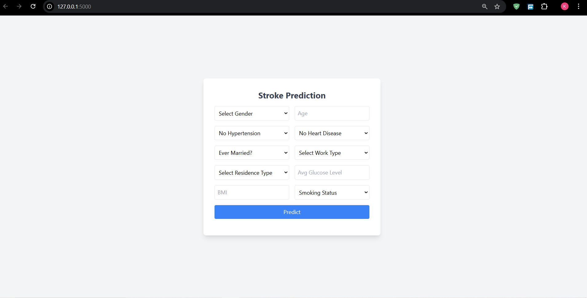

---

# 🏥 Stroke Prediction Web App  

This is a **Flask-based web application** for predicting the risk of stroke using **machine learning**. The model is trained on patient data and uses **StandardScaler** for feature scaling.  

---

## 🚀 Features  
✅ User-friendly web interface (HTML + Tailwind CSS)  
✅ Predicts stroke risk based on user input  
✅ Uses a **trained ML model** with **StandardScaler**  
✅ Backend powered by **Flask**  
✅ Simple and lightweight  

---

## 📸 Demo  

 

### 🖥 Web App Interface  
  


---

## 📂 Project Structure  

```
stroke-prediction-app/
│── static/               # (Optional) Static files (CSS, JS, Images)
│── templates/
│   ├── index.html        # Frontend UI with Tailwind CSS
│── demo/                 # Folder to store UI screenshots
│   ├── screenshot1.png   
│   ├── screenshot2.png   
│── Stroke_model.pkl      # Trained machine learning model
│── scaler.pkl            # StandardScaler used for feature scaling
│── app.py                # Flask backend
│── requirements.txt      # Required dependencies
│── README.md             # Project documentation
```

---

## 🛠 Installation  

### 1️⃣ **Clone the Repository**
```bash
git clone https://github.com/your-repo/stroke-prediction.git
cd stroke-prediction
```

### 2️⃣ **Create a Virtual Environment (Optional)**
```bash
python -m venv venv
source venv/bin/activate  # On macOS/Linux
venv\Scripts\activate     # On Windows
```

### 3️⃣ **Install Dependencies**
```bash
pip install -r requirements.txt
```

---

## 🏃‍♂️ Running the App  

```bash
python app.py
```
Your app will be running at **http://127.0.0.1:5000/** 🎉 

---

## 📊 Input Features & Value Mappings  

| Feature         | Description | Encodings |
|---------------|------------|-----------|
| `gender` | Gender | `Male=0`, `Female=1`, `Other=2` |
| `age` | Age in years | Numeric |
| `hypertension` | High blood pressure | `No=0`, `Yes=1` |
| `heart_disease` | Heart disease history | `No=0`, `Yes=1` |
| `ever_married` | Marital status | `No=0`, `Yes=1` |
| `work_type` | Type of work | `Private=0`, `Self-employed=1`, `children=2`, `Govt_job=3`, `Never_worked=4` |
| `Residence_type` | Living area | `Urban=1`, `Rural=0` |
| `avg_glucose_level` | Average glucose level | Numeric |
| `bmi` | Body Mass Index | Numeric |
| `smoking_status` | Smoking history | `never smoked=0`, `Unknown=1`, `formerly smoked=2`, `smokes=3` |

---

## 🐛 Troubleshooting  

- If you get **"ModuleNotFoundError"**, make sure you installed dependencies using:
  ```bash
  pip install -r requirements.txt
  ```
- If the app does not start, check if **Flask is installed** by running:
  ```bash
  python -m flask --version
  ```
- If the model is not predicting correctly, **verify StandardScaler is applied properly** in `app.py`.

---

## 🔥 Contributing  

Feel free to **fork** this project, **add features**, and create a **pull request**. 🚀  

---

## 📜 License  

This project is **free to use** under the **MIT License**.  

---
